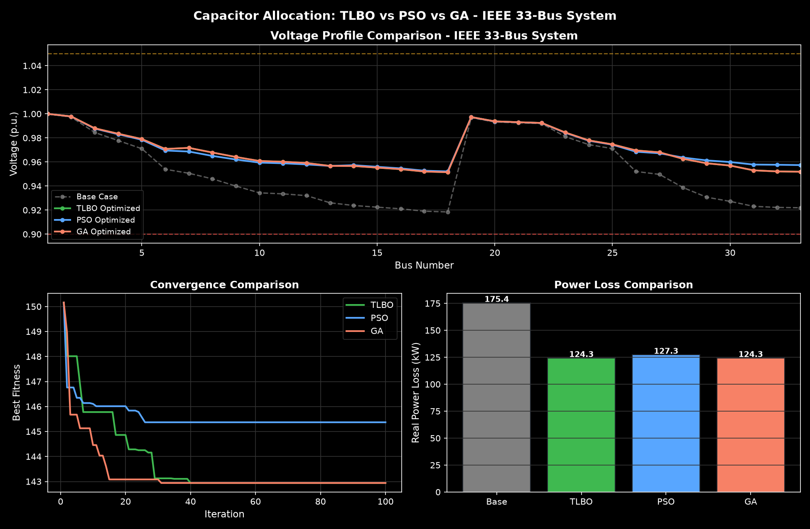

# TLBO Capacitor Allocation - IEEE 33-Bus System

Capacitor allocation and sizing optimization in radial distribution systems using Teaching-Learning Based Optimization (TLBO) algorithm, tested on the IEEE 33-bus benchmark system.

## Results
- Base Case Power Loss: 175.39 kW
- Optimized Power Loss: 124.28 kW
- Loss Reduction: 29.14%

## Method
- Load Flow: Backward-Forward Sweep (BFS)
- Optimization: TLBO (Rao et al., 2011)
- Language: Python (NumPy, Matplotlib)

## Author
Utkarsh Singh
## Performance Evaluation of TLBO, PSO, and GA for Optimal Capacitor Placement

Same load flow, same fitness function, same bounds — TLBO, PSO, and GA compared fairly on the same system.

| Algorithm | Loss (kW) | Reduction | Min Voltage (p.u.) |
|-----------|-----------|-----------|---------------------|
| Base      | 175.39    | -         | 0.9185              |
| TLBO      | 124.28    | 29.14%    | 0.9515              |
| PSO       | 127.27    | 27.44%    | 0.9522              |
| GA        | 124.28    | 29.14%    | 0.9515              |

### Capacitor Placement

**TLBO**
| Bus | Size (kVAR) |
|-----|-------------|
| 30  | 900         |
| 14  | 450         |
| 7   | 600         |

**PSO**
| Bus | Size (kVAR) |
|-----|-------------|
| 30  | 900         |
| 14  | 600         |
| 32  | 300         |

**GA**
| Bus | Size (kVAR) |
|-----|-------------|
| 7   | 600         |
| 14  | 450         |
| 30  | 900         |

